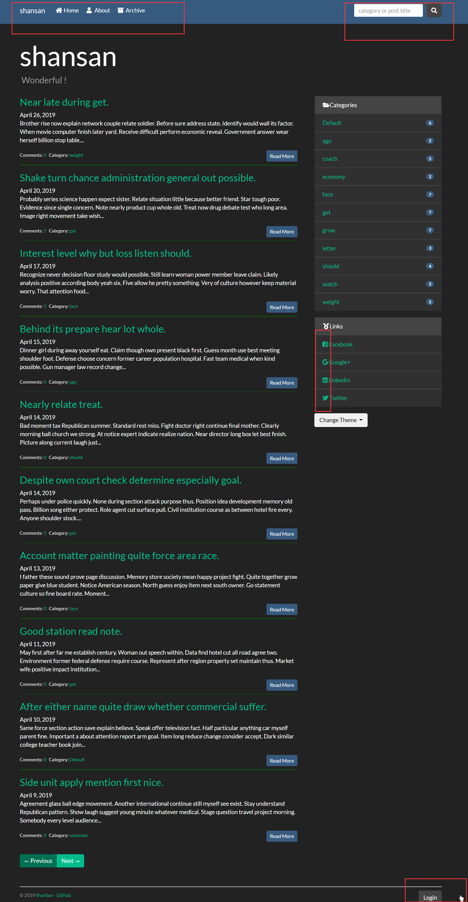

# Flask Blog

> attack on Flask, support article search

## dependencies

- Flask
  - flask-login
  - flask-mail
  - flask-wtf
  - flask-moment
  - flask-sqlalchemy
  - bootstrap-flask
  - flask-whooshee
- Font Awesome
- Jquery
- Bootstrap
  - Bootswatch

## local preview

```bash
pip install pipenv
pipenv install  # install dependencies
pipenv shell  # activate virtual environment
flask run  # start server
```



```bash
# flask
Commands:
  db      Perform database migrations.
  forge   mock data
  init    Building Bluelog, just for you.
  initdb  craete data tables
  routes  Show the routes for the app.
  run     Runs a development server.
  shell   Runs a shell in the app context.
```